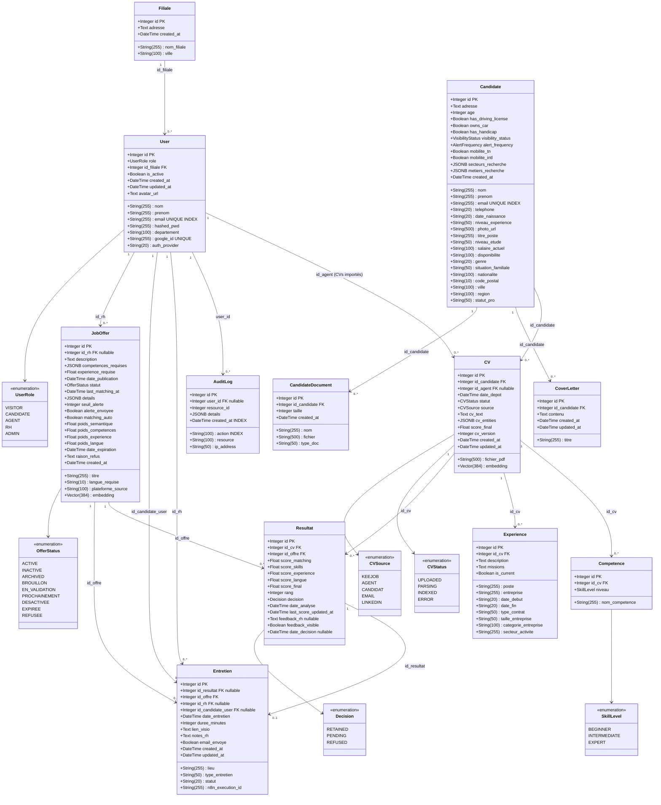

# Diagramme de Classes — Modèle de Données ATS RANDA

## Description

Ce diagramme représente le modèle de données complet de l'ATS RANDA, tel que défini dans `backend/app/models/db_models.py`. Il montre toutes les entités persistantes, leurs attributs avec types exacts (y compris les colonnes pgvector et JSONB), ainsi que toutes les relations de clés étrangères avec leurs cardinalités.

La classe centrale est **CV** : elle reçoit les embeddings vectoriels 384-dim, est liée aux compétences et expériences extraites par le pipeline NLP, et participe au matching via la table **Resultat**. La classe **Resultat** est la jonction pivot entre un CV et une offre d'emploi — elle contient les 4 sous-scores calculés par `scorer.py` ainsi que la décision RH.

## Diagramme

## Explication des relations

| Classe A | Relation | Classe B | Cardinalité | Signification |
|----------|----------|----------|-------------|---------------|
| `Filiale` | possède | `User` | 1 → 0..* | Une filiale regroupe plusieurs utilisateurs |
| `User` | importe | `CV` | 1 → 0..* | Un agent a importé ces CVs (FK `id_agent`) |
| `User` | crée | `JobOffer` | 1 → 0..* | Un RH est auteur des offres (`id_rh`) |
| `User` | génère | `AuditLog` | 1 → 0..* | Chaque action utilisateur est tracée |
| `User` | anime | `Entretien` | 1 → 0..* | Un RH conduit les entretiens (`id_rh`) |
| `User` | est convoqué | `Entretien` | 1 → 0..* | Un candidat-user reçoit une invitation |
| `Candidate` | dépose | `CV` | 1 → 0..* | Un candidat peut avoir plusieurs CVs |
| `Candidate` | rédige | `CoverLetter` | 1 → 0..* | Cascade delete à la suppression du candidat |
| `Candidate` | joint | `CandidateDocument` | 1 → 0..* | Cascade delete à la suppression du candidat |
| `CV` | a | `Competence` | 1 → 0..* | Cascade delete — compétences extraites par NLP |
| `CV` | a | `Experience` | 1 → 0..* | Cascade delete — expériences extraites par NLP |
| `CV` | participe à | `Resultat` | 1 → 0..* | Cascade delete — résultats de matching |
| `JobOffer` | génère | `Resultat` | 1 → 0..* | Cascade delete — résultats de matching |
| `JobOffer` | planifie | `Entretien` | 1 → 0..* | Une offre peut avoir plusieurs entretiens |
| `Resultat` | déclenche | `Entretien` | 1 → 0..1 | Un résultat RETAINED peut mener à un entretien |

## Notes techniques

### Colonnes pgvector
- `CV.embedding` : `Vector(384)` — vecteur 384-dim normalisé produit par `paraphrase-multilingual-MiniLM-L12-v2`
- `JobOffer.embedding` : `Vector(384)` — vecteur de l'offre construit depuis titre + description + compétences

Un index `ivfflat` (100 listes, distance cosinus) est créé sur `cvs.embedding` pour accélérer les requêtes de recherche des plus proches voisins lors du matching.

### Colonnes JSONB
- `CV.cv_entities` : objet JSON libre stockant les 15+ entités parsées (compétences, expériences, formations, langues, etc.)
- `JobOffer.competences_requises` : liste JSON des compétences requises (utilisée par `scorer.py` pour le calcul Jaccard)
- `JobOffer.details` : champs étendus libres (lieu, type de contrat, salaire, etc.)
- `Candidate.secteurs_recherche` / `metiers_recherche` : listes JSON de préférences

### Absence de table Candidature séparée
Il n'existe **pas** de table `candidatures` distincte dans le schéma. Quand un candidat postule via `POST /api/candidate/offers/{id}/apply`, un enregistrement **Resultat** est créé avec `decision=PENDING`. La "candidature" est donc représentée par ce Resultat initial.
