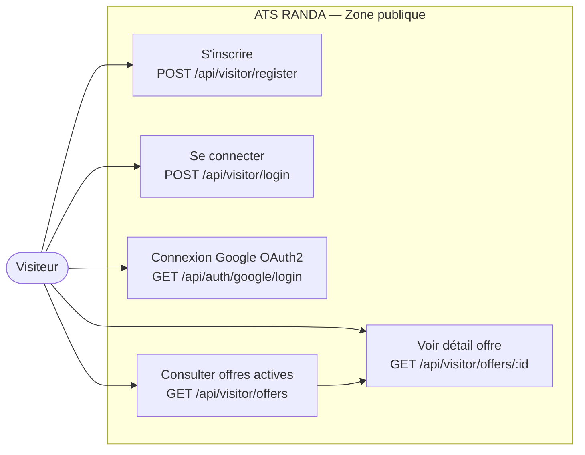
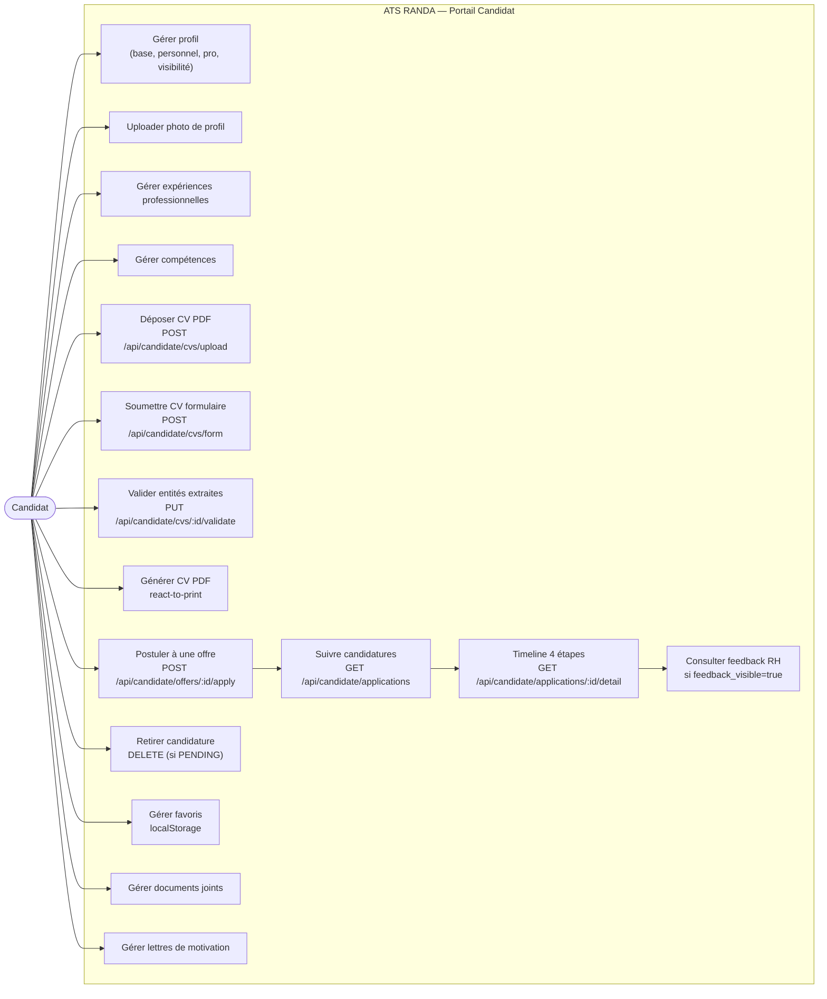
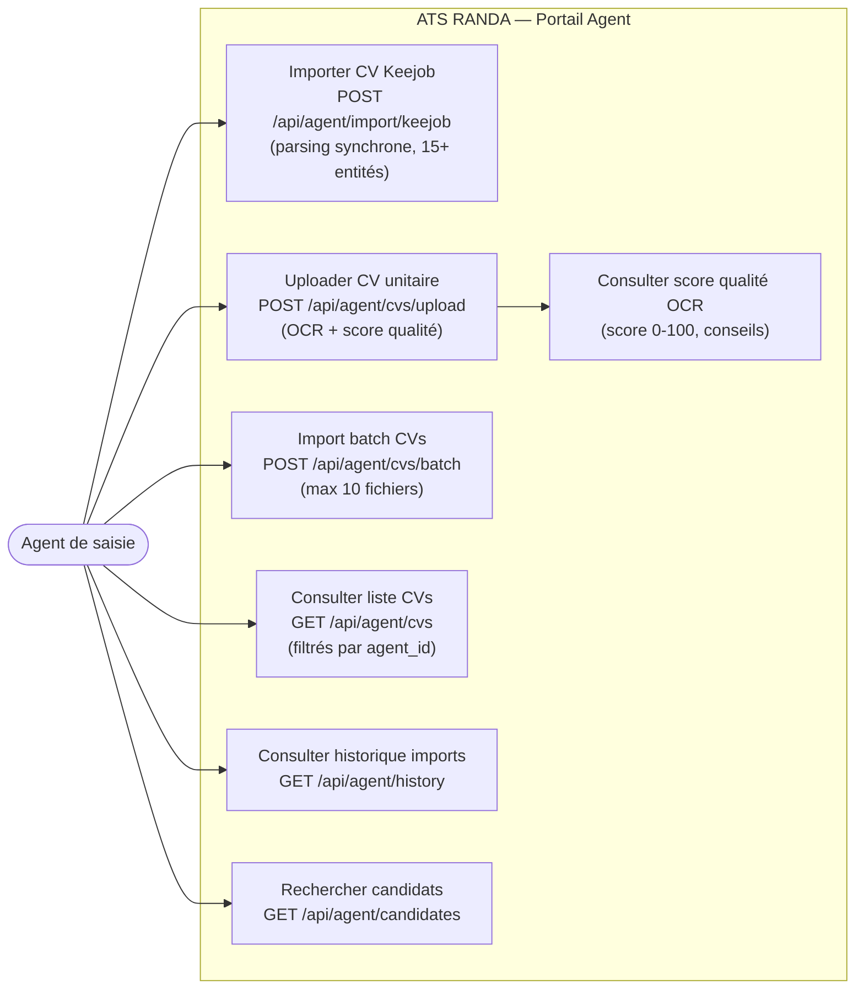
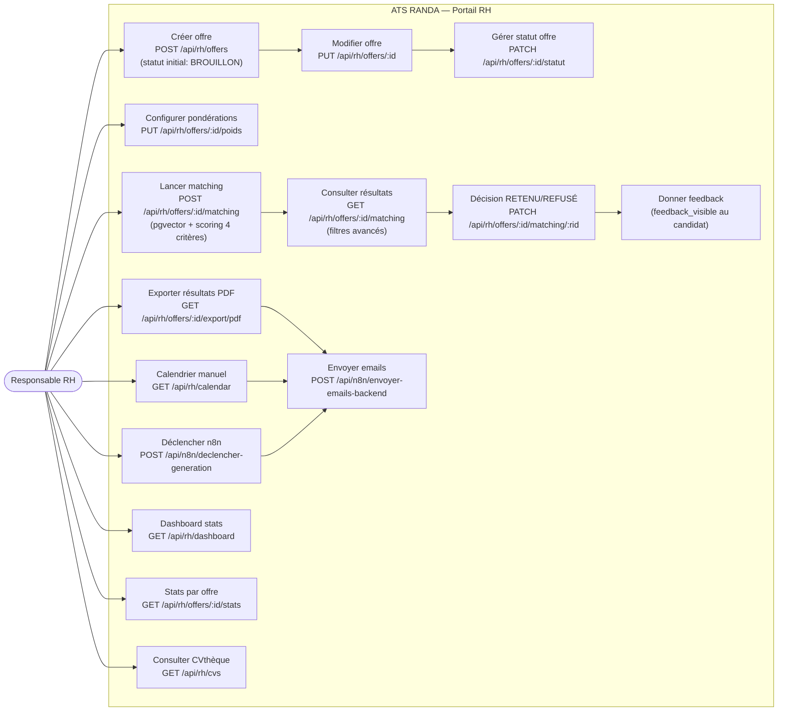
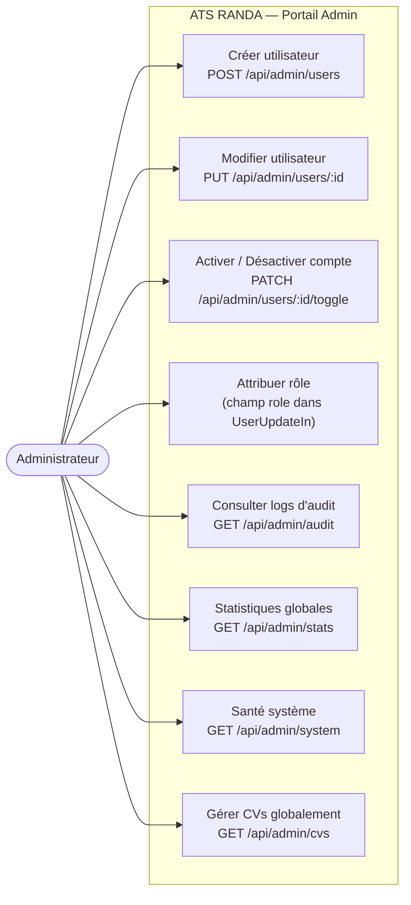

# Diagramme de Cas d'Utilisation — ATS RANDA

## Description

Ce diagramme identifie les 5 acteurs du système (Visiteur, Candidat, Agent, RH, Admin) et leurs cas d'utilisation respectifs, tels que dérivés des routes déclarées dans `backend/app/main.py`, `frontend/src/router/index.tsx` et les modules de routes FastAPI. Chaque acteur interagit avec un périmètre fonctionnel distinct, contrôlé par le RBAC défini dans `api/dependencies.py`.

Les cas d'utilisation sont organisés par portail (URLs préfixées `/candidate/*`, `/agent/*`, `/rh/*`, `/admin/*`). Le système ATS RANDA constitue la frontière du système, et les acteurs externes sont les utilisateurs humains ainsi que le système n8n pour les webhooks automatisés.

## Diagramme Global

```mermaid
flowchart LR
    VIS([Visiteur])
    CAN([Candidat])
    AGT([Agent])
    RH([Responsable RH])
    ADM([Administrateur])
    N8N([n8n Workflows])

    subgraph ATS_RANDA["ATS RANDA — Système"]

        subgraph PUBLIC["Zone publique"]
            UC_REG["S'inscrire"]
            UC_LOG["Se connecter"]
            UC_GOOGLE["Connexion Google OAuth2"]
            UC_LIST_OFF["Consulter offres publiques"]
            UC_DETAIL_OFF["Voir détail d'une offre"]
        end

        subgraph CAND_ZONE["Portail Candidat /candidate/*"]
            UC_PROFIL["Gérer son profil"]
            UC_CV_UP["Déposer un CV"]
            UC_CV_FORM["Soumettre CV via formulaire"]
            UC_CV_VALID["Valider entités extraites"]
            UC_POSTULER["Postuler à une offre"]
            UC_SUIVI["Suivre candidatures timeline"]
            UC_FEEDBACK["Consulter feedback RH"]
            UC_GEN_CV["Générer CV PDF"]
            UC_FAV["Gérer favoris"]
            UC_LETTRE["Gérer lettres de motivation"]
            UC_DOCS["Gérer documents"]
        end

        subgraph AGENT_ZONE["Portail Agent /agent/*"]
            UC_IMP_KEEJOB["Importer CV Keejob"]
            UC_IMP_BATCH["Import batch CVs"]
            UC_OCR_QUAL["Consulter qualité OCR"]
            UC_LIST_CAND["Gérer liste candidats"]
            UC_HIST["Consulter historique imports"]
        end

        subgraph RH_ZONE["Portail RH /rh/*"]
            UC_CRUD_OFF["Gérer offres CRUD"]
            UC_MATCH["Lancer matching sémantique"]
            UC_RESULTATS["Consulter résultats matching"]
            UC_DECISION["Retenir / Refuser candidat"]
            UC_FEEDBACK_RH["Donner feedback candidat"]
            UC_CAL["Gérer calendrier entretiens"]
            UC_N8N["Déclencher workflow n8n"]
            UC_CVTH["Consulter CVthèque"]
            UC_STATS["Consulter statistiques"]
            UC_POIDS["Configurer pondérations scoring"]
        end

        subgraph ADMIN_ZONE["Portail Admin /admin/*"]
            UC_USERS["Gérer utilisateurs"]
            UC_ROLES["Attribuer rôles"]
            UC_AUDIT["Consulter logs d'audit"]
            UC_HEALTH["Vérifier santé système"]
            UC_STATS_G["Statistiques globales"]
        end

        subgraph N8N_ZONE["Zone n8n /api/n8n/*"]
            UC_CRENEAUX["Générer créneaux entretien"]
            UC_EMAILS["Envoyer invitations email"]
            UC_WH_IN["Webhook entrant"]
        end
    end

    VIS --> UC_REG
    VIS --> UC_LOG
    VIS --> UC_GOOGLE
    VIS --> UC_LIST_OFF
    VIS --> UC_DETAIL_OFF

    CAN --> UC_PROFIL
    CAN --> UC_CV_UP
    CAN --> UC_CV_FORM
    CAN --> UC_CV_VALID
    CAN --> UC_POSTULER
    CAN --> UC_SUIVI
    CAN --> UC_FEEDBACK
    CAN --> UC_GEN_CV
    CAN --> UC_FAV
    CAN --> UC_LETTRE
    CAN --> UC_DOCS
    CAN --> UC_LIST_OFF

    AGT --> UC_IMP_KEEJOB
    AGT --> UC_IMP_BATCH
    AGT --> UC_OCR_QUAL
    AGT --> UC_LIST_CAND
    AGT --> UC_HIST

    RH --> UC_CRUD_OFF
    RH --> UC_MATCH
    RH --> UC_RESULTATS
    RH --> UC_DECISION
    RH --> UC_FEEDBACK_RH
    RH --> UC_CAL
    RH --> UC_N8N
    RH --> UC_CVTH
    RH --> UC_STATS
    RH --> UC_POIDS

    ADM --> UC_USERS
    ADM --> UC_ROLES
    ADM --> UC_AUDIT
    ADM --> UC_HEALTH
    ADM --> UC_STATS_G

    N8N --> UC_WH_IN
    UC_N8N --> UC_CRENEAUX
    UC_N8N --> UC_EMAILS
```

## Diagrammes Détaillés par Acteur

### Visiteur

### Candidat

### Agent

### Responsable RH

### Administrateur

## Tableau des droits d'accès

| Fonctionnalité | Visiteur | Candidat | Agent | RH | Admin |
|---------------|:--------:|:--------:|:-----:|:--:|:-----:|
| Consulter offres publiques | ✅ | ✅ | — | — | — |
| S'inscrire / Se connecter | ✅ | ✅ | ✅ | ✅ | ✅ |
| Connexion Google OAuth2 | ✅ | ✅ | — | — | — |
| Gérer profil candidat | — | ✅ | — | — | — |
| Déposer / gérer CVs | — | ✅ | — | — | — |
| Postuler à une offre | — | ✅ | — | — | — |
| Suivre candidatures (timeline) | — | ✅ | — | — | — |
| Générer CV PDF | — | ✅ | — | — | — |
| Importer CVs Keejob/batch | — | — | ✅ | — | — |
| Consulter qualité OCR | — | — | ✅ | — | — |
| Historique imports | — | — | ✅ | — | — |
| Créer / modifier offres | — | — | — | ✅ | — |
| Lancer matching sémantique | — | — | — | ✅ | — |
| Décision RETENU/REFUSÉ | — | — | — | ✅ | — |
| Donner feedback visible | — | — | — | ✅ | — |
| Calendrier entretiens | — | — | — | ✅ | — |
| Déclencher workflow n8n | — | — | — | ✅ | — |
| Statistiques par offre | — | — | — | ✅ | — |
| CVthèque globale | — | — | — | ✅ | ✅ |
| Gérer utilisateurs / rôles | — | — | — | — | ✅ |
| Logs d'audit | — | — | — | — | ✅ |
| Santé système | — | — | — | — | ✅ |
| Statistiques globales système | — | — | — | — | ✅ |
