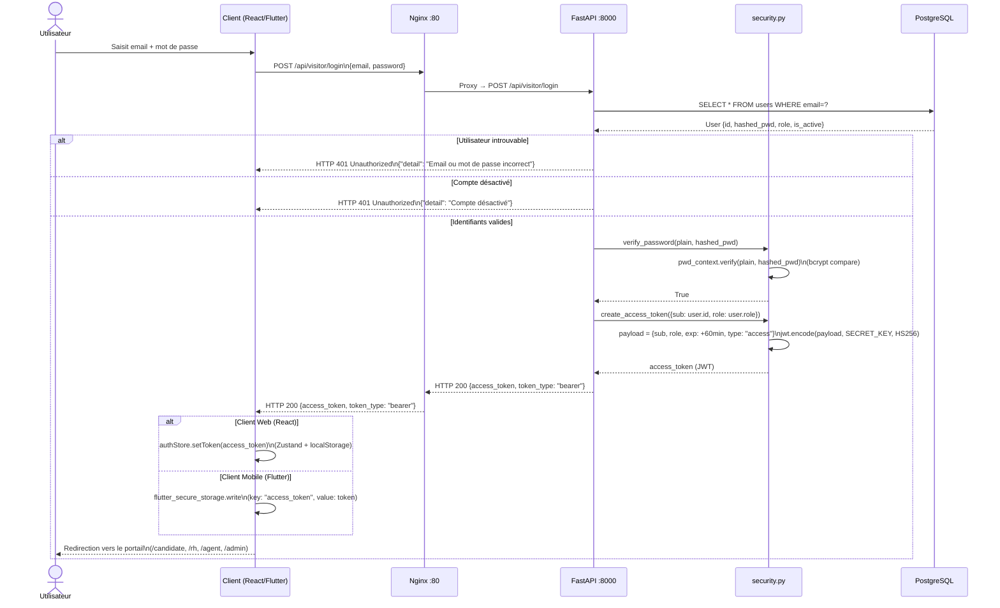
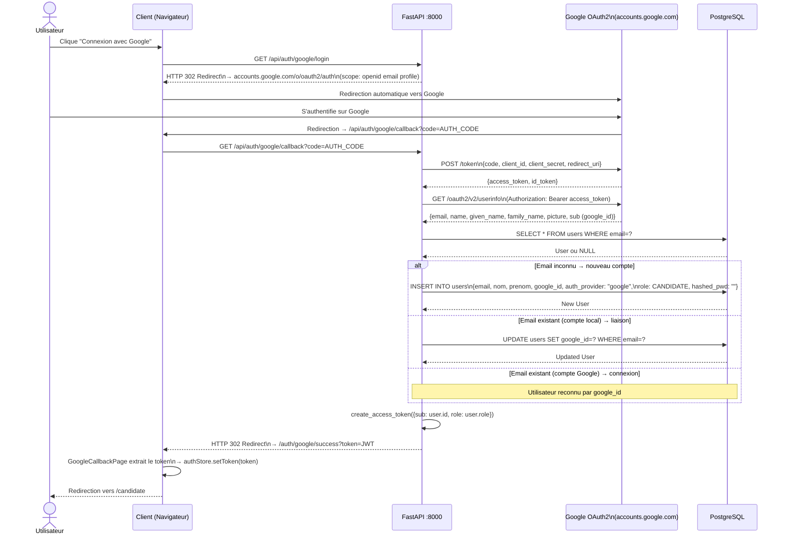
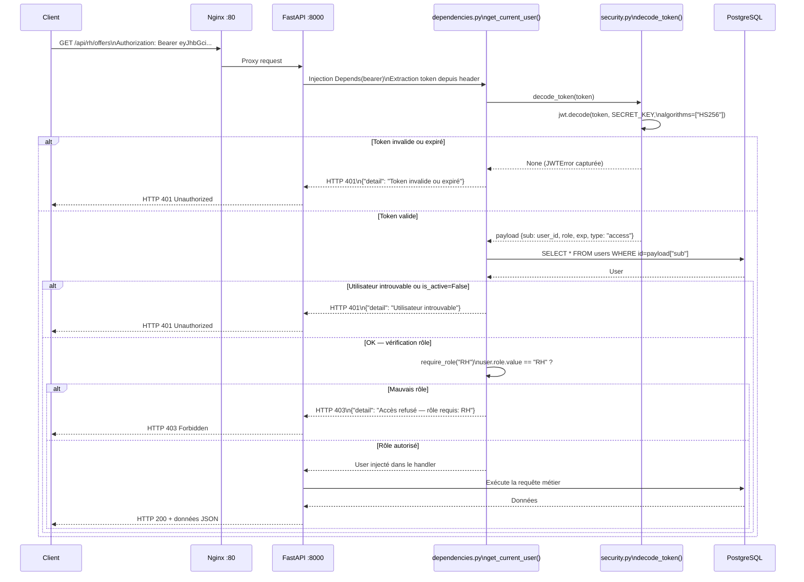
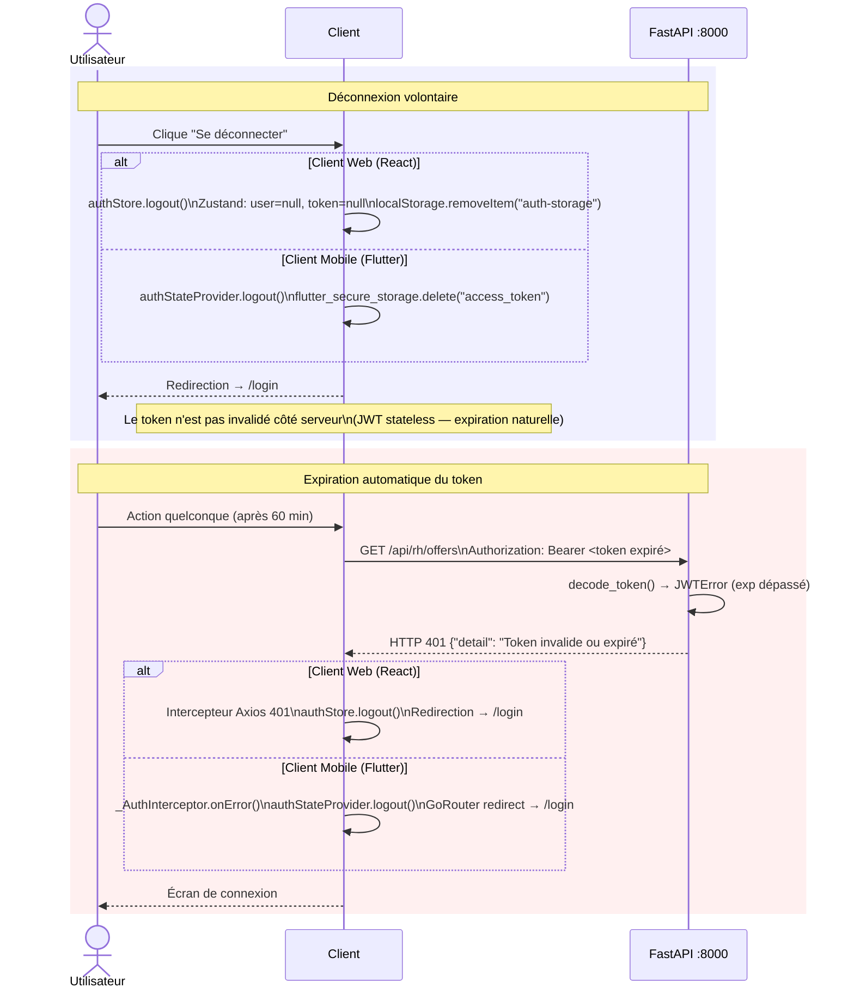

# Diagrammes de Séquence — Authentification

## Description

Ces diagrammes décrivent les flux d'authentification complets de l'ATS RANDA, tels qu'implémentés dans `backend/app/core/security.py`, `backend/app/api/routes/visitor/auth.py`, `backend/app/api/routes/auth/google.py` et `backend/app/api/dependencies.py`. Ils montrent les interactions entre le client (web React ou app Flutter), Nginx, FastAPI, le module de sécurité bcrypt/JWT, et la base de données PostgreSQL.

---

## 1. Connexion classique (email / mot de passe)

Le flux de connexion locale suit le schéma : soumission des identifiants → vérification bcrypt → génération JWT → stockage côté client → utilisation sur les requêtes suivantes.

---

## 2. Connexion Google OAuth2

Le flux OAuth2 implique Google comme serveur d'autorisation. Les routes sont définies dans `backend/app/api/routes/auth/google.py`.

---

## 3. Validation JWT sur une route protégée

Ce diagramme montre comment chaque requête vers une route protégée est validée, via la dépendance `get_current_user` définie dans `api/dependencies.py`.

---

## 4. Déconnexion et expiration du token

