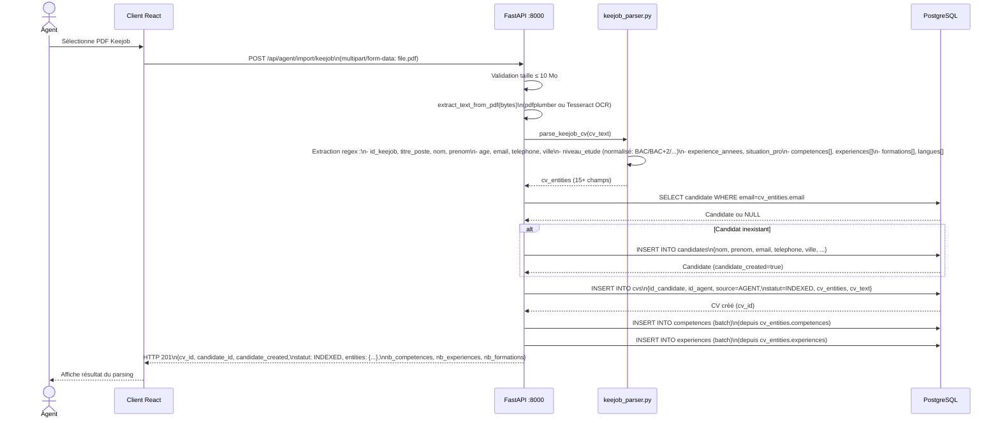
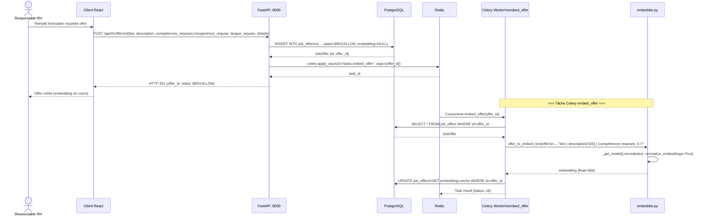
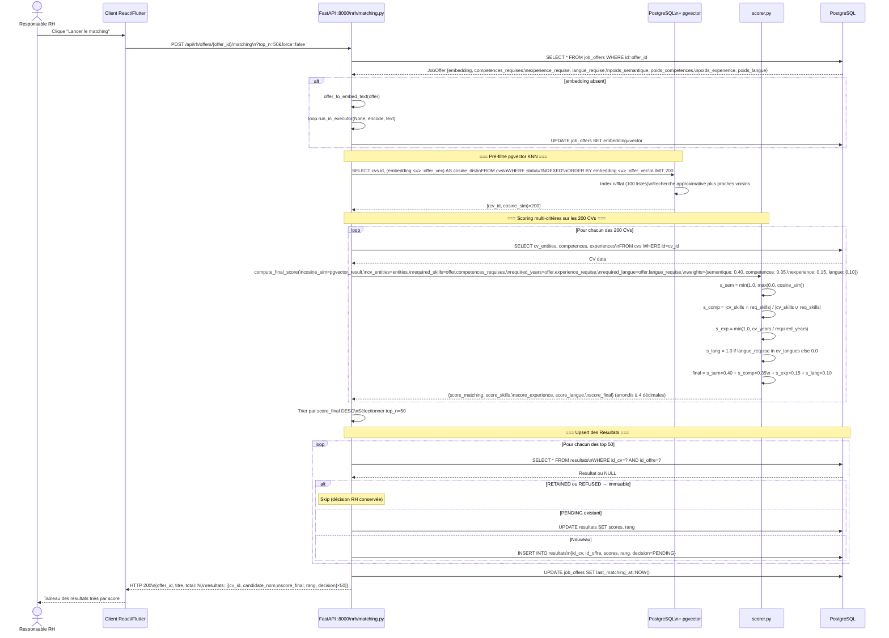
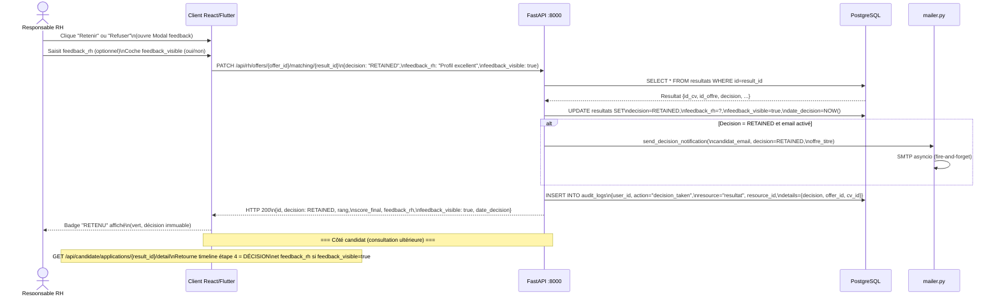

# Diagrammes de Séquence — Pipeline NLP et Matching

## Description

Ces diagrammes décrivent le pipeline NLP complet d'ATS RANDA, depuis l'import d'un CV jusqu'à la prise de décision RH. Ils sont basés sur le code réel de `backend/app/tasks/cv_tasks.py` (tâche `process_cv_on_upload`), `backend/app/nlp/embedder.py`, `backend/app/nlp/scorer.py`, `backend/app/api/routes/rh/matching.py` et `backend/app/tasks/offer_tasks.py`.

---

## 1. Import et parsing d'un CV Keejob (synchrone)

L'import Keejob est le seul flux de parsing **synchrone** dans le système — le parser régex s'exécute dans la requête HTTP, pas dans Celery.



---

## 2. Upload CV candidat + traitement asynchrone Celery

Pour les CVs déposés par un candidat ou importés par un agent (hors Keejob), le traitement NLP est délégué à la tâche Celery `process_cv_on_upload`.

```mermaid
sequenceDiagram
    actor CAN as Candidat
    participant C as Client React
    participant API as FastAPI :8000
    participant DB as PostgreSQL
    participant RDS as Redis (Broker)
    participant CEL as Celery Worker\nprocess_cv_on_upload
    participant OCR as ocr.py\n(Tesseract)
    participant PAR as generic_parser.py
    participant EMB as embedder.py\nparaphrase-multilingual-MiniLM-L12-v2
    participant SCO as scorer.py

    CAN->>C: Sélectionne fichier PDF/image
    C->>API: POST /api/candidate/cvs/upload\n(multipart/form-data: file)

    API->>API: Sauvegarde fichier\n→ /app/uploads/cvs/
    API->>DB: INSERT INTO cvs\n{id_candidate, source=CANDIDAT,\nstatut=UPLOADED, fichier_pdf}
    DB-->>API: CV {id: cv_id}

    API->>RDS: celery.apply_async(\n"tasks.process_cv_on_upload",\nargs=[cv_id])
    RDS-->>API: task_id (acknowledged)

    API-->>C: HTTP 201 {cv_id, statut: UPLOADED}
    C-->>CAN: "CV déposé — analyse en cours..."

    Note over CEL,SCO: === Traitement asynchrone dans Celery Worker ===

    RDS->>CEL: Consomme tâche process_cv_on_upload(cv_id)

    CEL->>DB: SELECT cv JOIN competences JOIN experiences\nWHERE cv.id=cv_id
    DB-->>CEL: CV object

    CEL->>OCR: extract_text_from_pdf(bytes)\n(pdfplumber si numérique\nou Tesseract fra+eng+ara si scanné)
    OCR-->>CEL: cv_text (texte brut)

    CEL->>PAR: parse_generic_cv(cv_text)
    PAR-->>CEL: cv_entities {competences, experiences, formations, langues, ...}

    CEL->>DB: UPDATE cvs SET cv_text=?, cv_entities=?

    CEL->>EMB: cv_to_embed_text(cv_entities, cv_text)\n→ "titre | Compétences: X,Y,Z | poste chez entrep..."
    EMB->>EMB: _get_model().encode(text,\nnormalize_embeddings=True)\n(synchrone CPU-bound, ~20-50ms)
    EMB-->>CEL: embedding [float×384] normalisé

    CEL->>DB: UPDATE cvs SET\nembedding=vector, statut=INDEXED,\ncv_version=cv_version+1

    Note over CEL,SCO: === Matching automatique contre toutes les offres ACTIVE ===

    CEL->>DB: SELECT * FROM job_offers\nWHERE statut=ACTIVE
    DB-->>CEL: active_offers[]

    loop Pour chaque offre active
        CEL->>CEL: cosine_sim = dot(cv_embedding, offer_embedding)\n(embeddings normalisés → dot = cosinus)
        CEL->>SCO: compute_final_score(\ncosine_sim, cv_entities,\noffer.competences_requises,\noffer.experience_requise,\noffer.langue_requise)
        SCO-->>CEL: {score_matching, score_skills,\nscore_experience, score_langue, score_final}

        CEL->>DB: SELECT resultat WHERE id_cv=? AND id_offre=?
        DB-->>CEL: Resultat ou NULL

        alt Resultat existant RETAINED ou REFUSED
            Note over CEL: SKIP — décision RH immuable
        else Resultat existant PENDING
            CEL->>DB: UPDATE resultats SET scores, last_score_updated_at
        else Pas de Resultat
            CEL->>DB: INSERT INTO resultats\n{id_cv, id_offre, scores, decision=PENDING}
        end
    end

    CEL->>DB: COMMIT
    CEL-->>RDS: Task result {status: ok, cv_id, cv_version,\ncreated: N, updated: M, skipped: K}
```

---

## 3. Création d'une offre et génération d'embedding



---

## 4. Déclenchement du matching complet (flux principal)

C'est le flux le plus important du système. Il est déclenché manuellement par le RH depuis l'interface.



---

## 5. Prise de décision RH (Retenir / Refuser)


