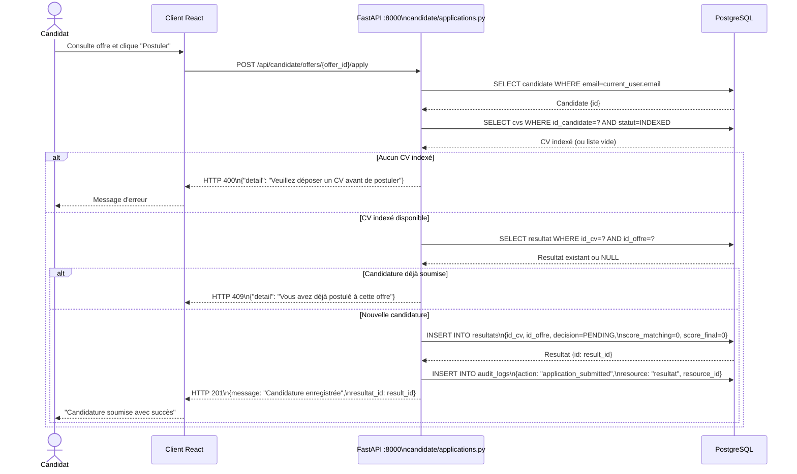
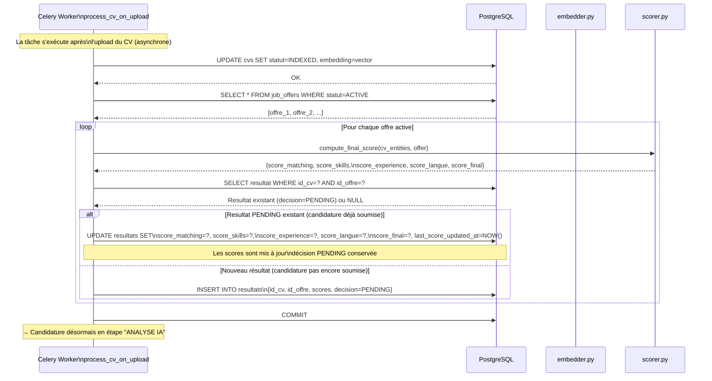
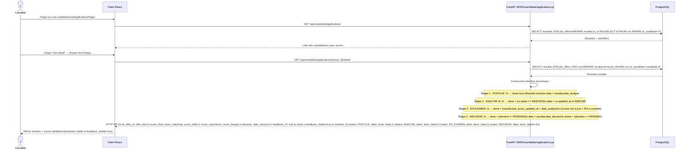
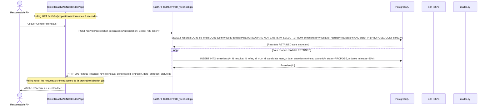
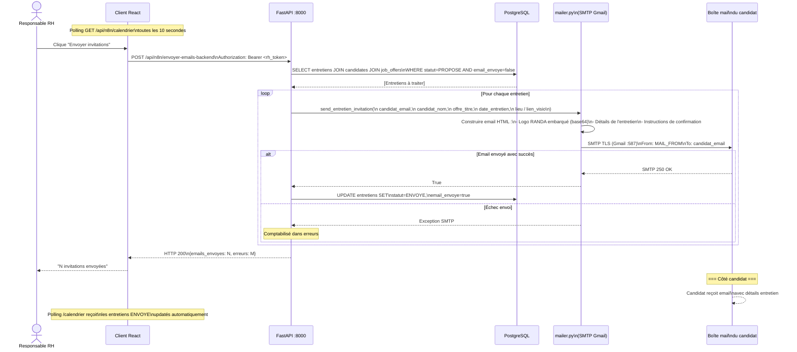

# Diagrammes de Séquence — Cycle de vie d'une candidature

## Description

Ces diagrammes tracent le parcours complet d'une candidature dans ATS RANDA, de la soumission par le candidat jusqu'à l'invitation à un entretien. Ils illustrent l'interaction entre le portail candidat (`/api/candidate/*`), le moteur NLP (Celery), le portail RH (`/api/rh/*`), le système n8n et le mailer SMTP. La "candidature" dans ATS RANDA est représentée par un enregistrement **Resultat** — il n'existe pas de table `candidatures` séparée dans le modèle de données.

---

## 1. Dépôt de candidature par le candidat

---

## 2. Analyse IA et mise à jour du statut (si CV non encore indexé)

Ce flux se produit quand le candidat a uploadé un CV avant de postuler, mais que le traitement Celery n'est pas encore terminé au moment de la candidature.

---

## 3. Consultation de la timeline par le candidat

La timeline 4 étapes est calculée dynamiquement à partir de l'état du Resultat.

---

## 4. Workflow n8n — Génération de créneaux d'entretien

---

## 5. Envoi d'invitation d'entretien par email

