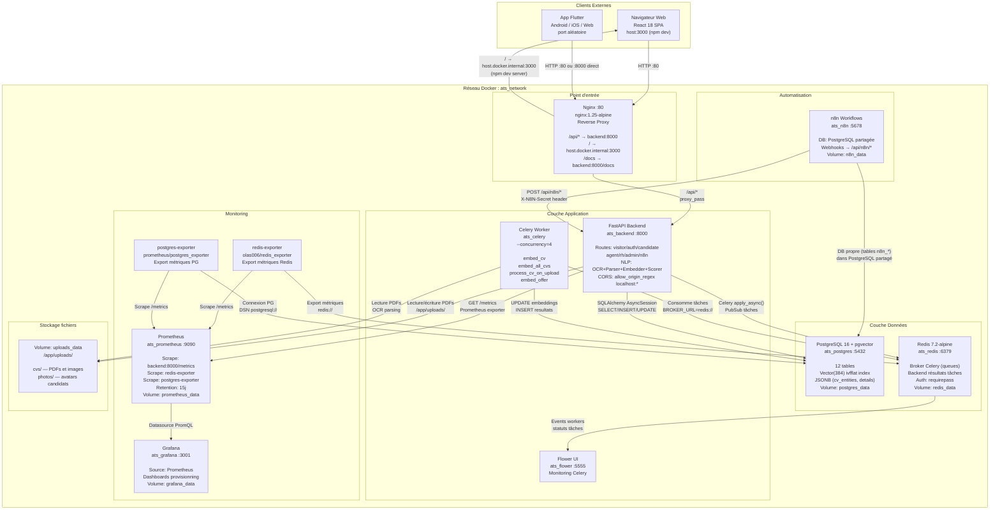

# Diagramme de Composants — Architecture Technique ATS RANDA

## Description

Ce diagramme représente l'architecture distribuée complète d'ATS RANDA telle que définie dans `docker-compose.yml`. Il montre les 11 services Docker, leur réseau interne (`ats_network`), les flux de données entre composants, ainsi que les clients externes (navigateur web React, application Flutter). Chaque composant est un container Docker autonome, sauf le serveur de développement frontend (npm, sur la machine hôte).

---

## Diagramme

---

## Description des composants

| Composant | Image Docker | Port | Rôle | Dépend de |
|-----------|-------------|------|------|-----------|
| **Nginx** | `nginx:1.25-alpine` | 80 | Reverse proxy, point d'entrée unique | backend |
| **FastAPI Backend** | Build local (Dockerfile) | 8000 | API REST, logique métier, NLP | postgres (healthy), redis (healthy) |
| **Celery Worker** | Build local | — | Tâches asynchrones NLP (4 workers) | backend, redis |
| **Flower** | Build local | 5555 | Monitoring visuel des tâches Celery | redis, celery_worker |
| **PostgreSQL 16 + pgvector** | `pgvector/pgvector:pg16` | 5432 | Base de données principale + vecteurs | — |
| **Redis 7.2** | `redis:7.2-alpine` | 6379 | Broker Celery + backend résultats | — |
| **n8n** | `n8nio/n8n:latest` | 5678 | Orchestrateur de workflows RH | postgres (healthy), redis (healthy) |
| **Prometheus** | `prom/prometheus:v2.52.0` | 9090 | Collecte métriques (scraping) | — |
| **Grafana** | `grafana/grafana:10.4.0` | 3001 | Visualisation métriques | prometheus |
| **redis-exporter** | `oliver006/redis_exporter:v1.61.0` | — | Export métriques Redis → Prometheus | redis |
| **postgres-exporter** | `prometheuscommunity/postgres-exporter:v0.15.0` | — | Export métriques PG → Prometheus | postgres |

---

## Flux de données principaux

1. **Requête utilisateur** : Client → Nginx :80 → FastAPI :8000 (via proxy `/api/*`)
2. **Frontend React** : Nginx :80 proxifie `/` vers `host.docker.internal:3000` (serveur npm sur l'hôte)
3. **Lecture/écriture base** : FastAPI → PostgreSQL via SQLAlchemy AsyncSession
4. **Publication tâche Celery** : FastAPI → Redis (LPUSH sur queue `celery`) → Celery Worker (BRPOP)
5. **Résultat tâche** : Celery Worker → Redis (SETEX résultat) → FastAPI (si polling)
6. **Traitement NLP** : Celery Worker → lit PDF dans uploads_data → OCR/parse → encode → PostgreSQL
7. **Métriques** : Prometheus scrape FastAPI `/metrics` + redis-exporter + postgres-exporter → Grafana
8. **Webhooks n8n** : n8n → POST `/api/n8n/*` (header `X-N8N-Secret`) → FastAPI
9. **Emails** : FastAPI (mailer.py) → SMTP externe Gmail :587 (sortant, hors réseau Docker)
