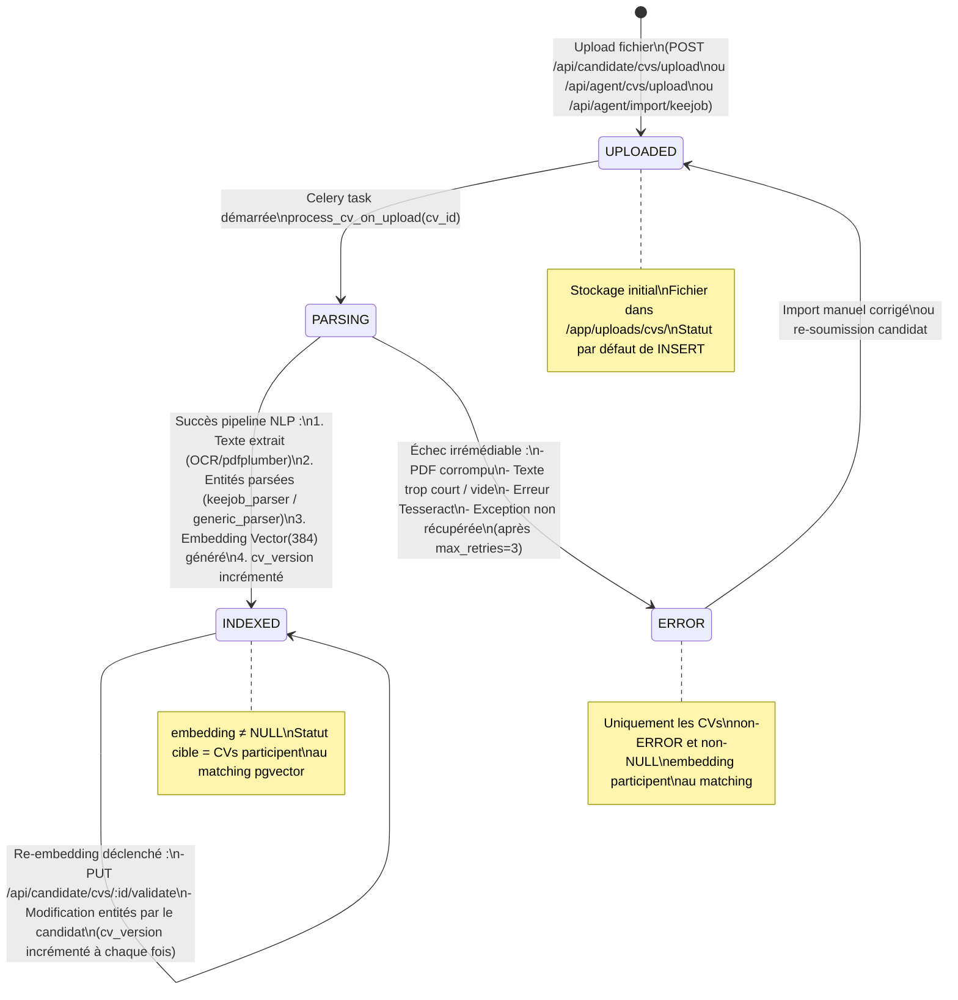
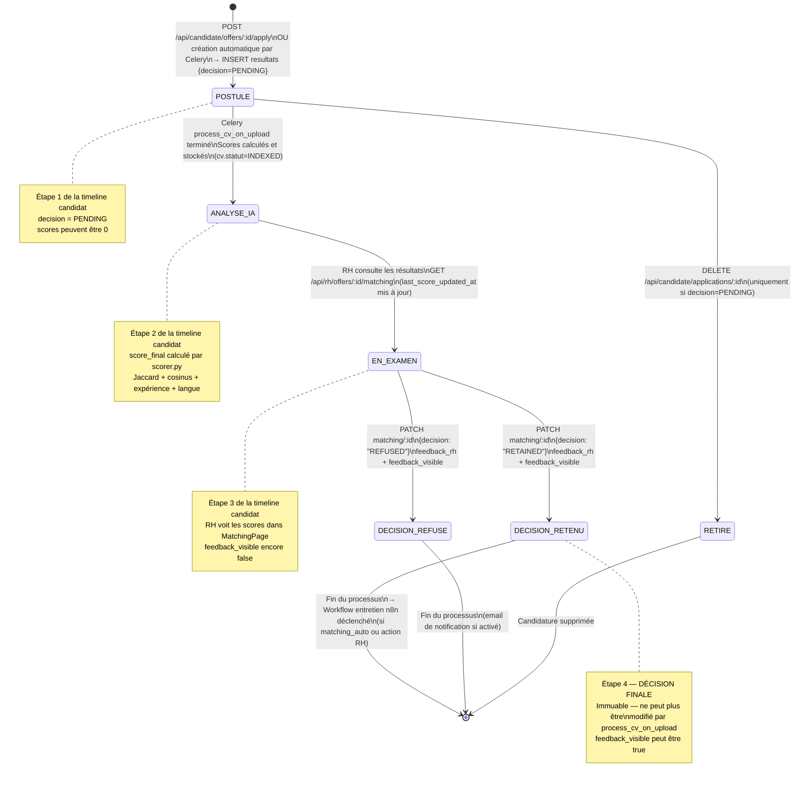
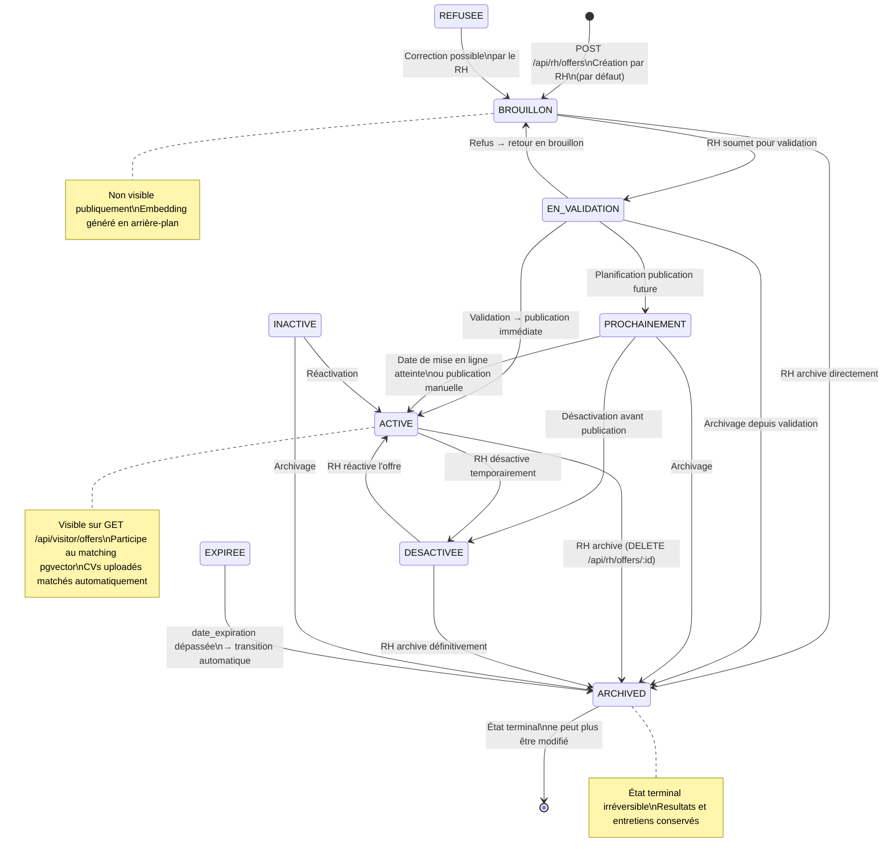
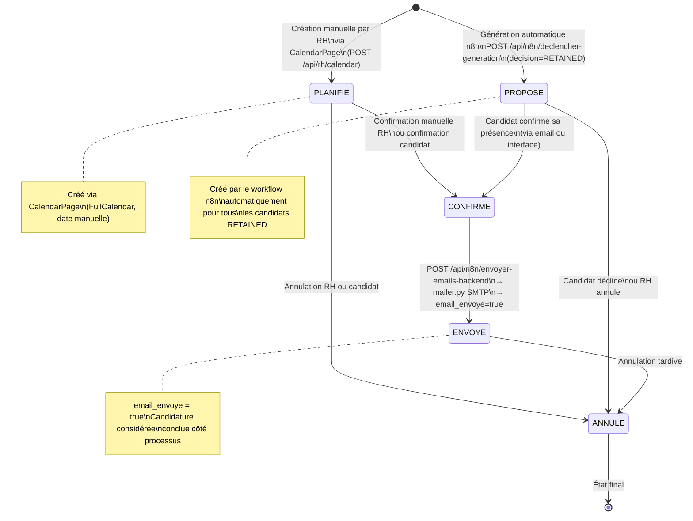
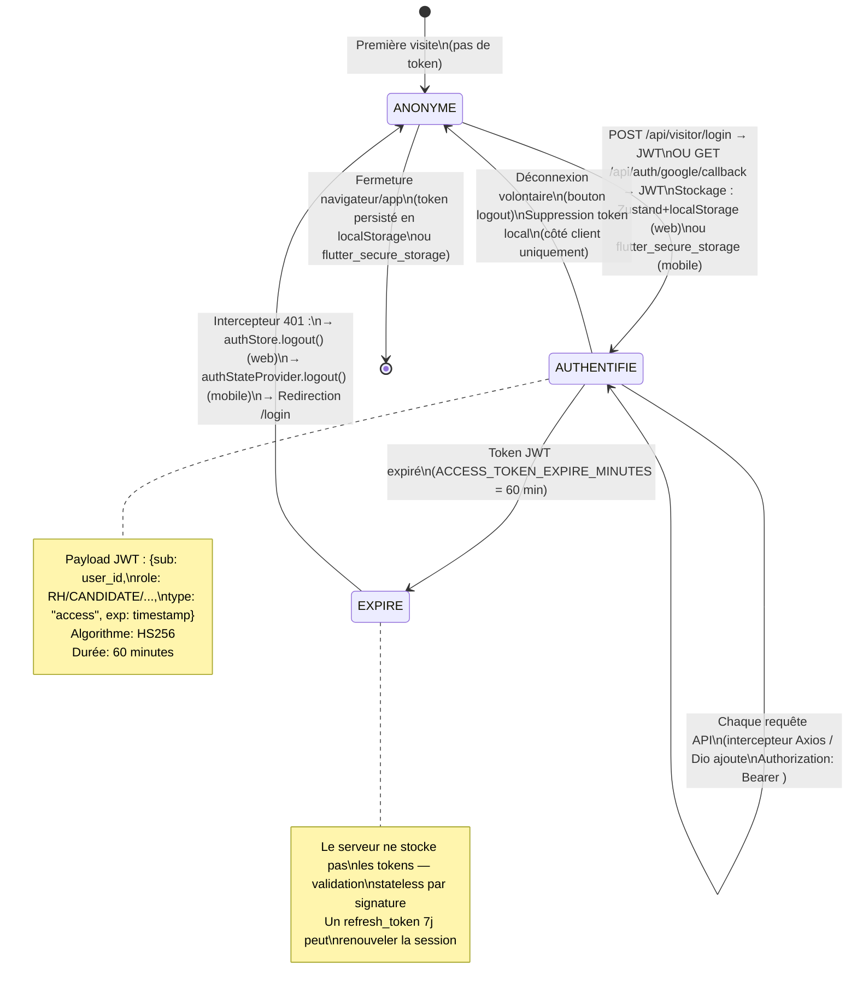

# Diagrammes d'États — Cycles de vie des entités ATS RANDA

## Description

Ces diagrammes représentent les machines à états de chaque entité principale du système, dérivées des énumérations définies dans `backend/app/models/db_models.py` (CVStatus, OfferStatus, Decision, SkillLevel), de la logique métier dans les services et routes FastAPI, et du comportement des tâches Celery dans `cv_tasks.py`. Chaque transition indique son déclencheur (action utilisateur, tâche automatique ou événement système).

---

## 1. États d'un CV (`cvs.statut`)

Les états d'un CV suivent le cycle de traitement NLP, depuis l'upload brut jusqu'à l'indexation complète avec embedding 384-dim.

### Description des transitions CV

| De | Vers | Déclencheur | Acteur |
|----|------|-------------|--------|
| `[*]` | `UPLOADED` | Upload d'un fichier via POST API | Candidat ou Agent |
| `UPLOADED` | `PARSING` | Dépôt tâche dans Redis + démarrage Celery | Système (automatique) |
| `PARSING` | `INDEXED` | OCR + parsing + encode() réussis | Celery Worker |
| `PARSING` | `ERROR` | Exception après 3 tentatives | Celery Worker |
| `INDEXED` | `INDEXED` | Modification/validation des entités | Candidat (self-transition) |
| `ERROR` | `UPLOADED` | Réimport ou correction manuelle | Agent / Admin |

---

## 2. États d'une candidature / Resultat (`resultats.decision` + timeline)

Un Resultat représente à la fois le score de matching et la candidature. La timeline 4 étapes est dérivée dynamiquement de l'état du Resultat et du CV associé.

---

## 3. États d'une offre d'emploi (`job_offers.statut`)

Machine à états complexe avec 9 états possibles et des transitions strictement contrôlées par `PATCH /api/rh/offers/:id/statut`.

---

## 4. États d'un entretien — Workflow n8n (`entretiens.statut`)

---

## 5. États de la session utilisateur

