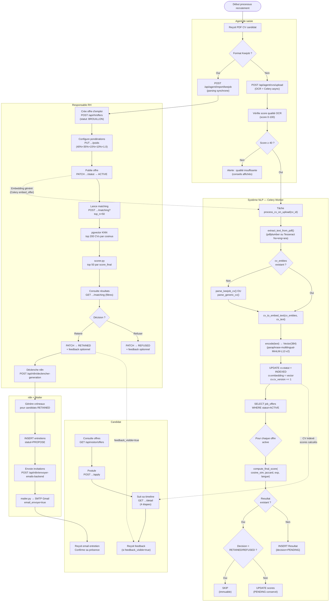
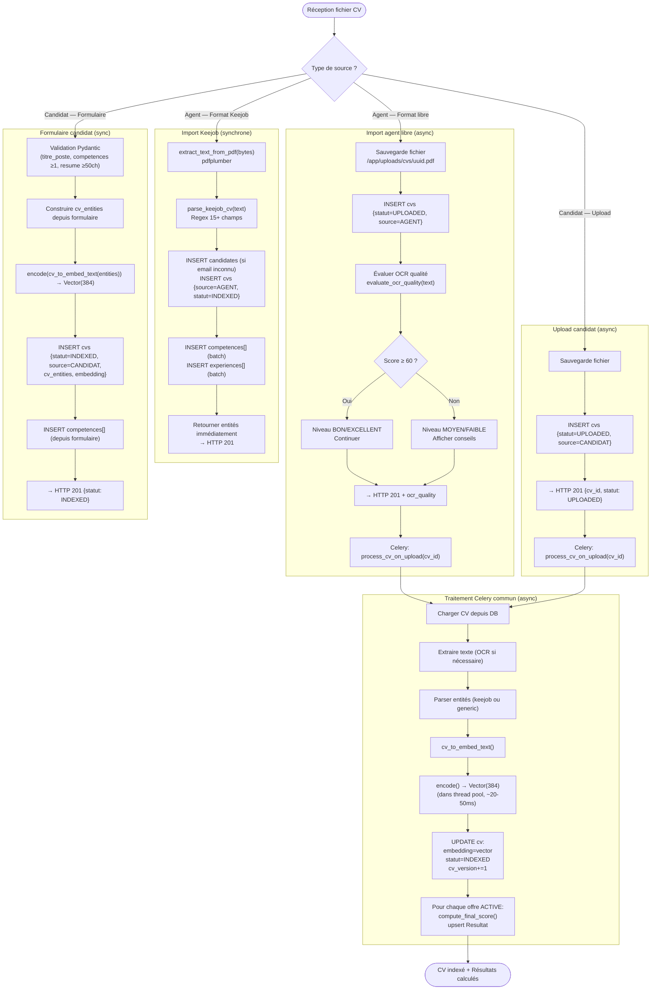
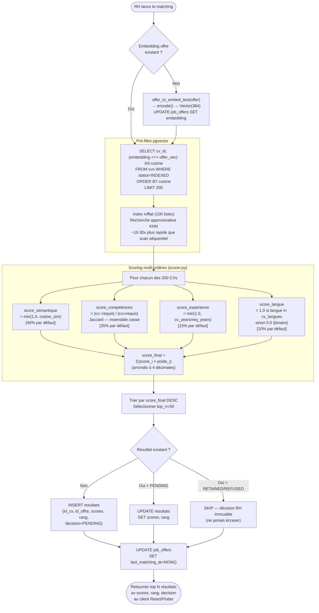

# Diagrammes d'Activités — Processus Métier ATS RANDA

## Description

Ces diagrammes d'activités modélisent les processus métier complets du système ATS RANDA, en utilisant des swimlanes pour distinguer les acteurs. Ils illustrent les décisions, les parallélismes et les flux entre les différents acteurs : Agent de saisie, Responsable RH, le système NLP (Celery), le Candidat, et le système n8n. Ces diagrammes sont construits à partir de la logique métier implémentée dans `cv_tasks.py`, `scorer.py`, les routes FastAPI et le workflow n8n.

---

## 1. Processus complet de recrutement (bout en bout)



---

## 2. Processus d'import et indexation de CV



---

## 3. Processus de matching sémantique



---

## 4. Processus de génération et envoi d'invitations

```mermaid
flowchart TD
    START([RH clique "Générer créneaux"]) --> Q1

    subgraph RH_SWIM["RH — N8NCalendarPage"]
        Q1["POST /api/n8n/declencher-generation"]
        Q2["Consulte résultats\n(polling 5s GET /api/n8n/propositions)"]
        Q3["Valide les créneaux proposés"]
        Q4["POST /api/n8n/envoyer-emails-backend"]
        Q5["Consulte calendrier mis à jour\n(polling 10s GET /api/n8n/calendrier)"]
    end

    subgraph BACKEND_N8N["Backend — n8n_webhook.py"]
        B1["SELECT resultats JOIN candidates\nWHERE decision=RETAINED\nAND pas d'entretien PROPOSE/CONFIRME"]
        B2{"Candidats\nà traiter ?"}
        B3["Pour chaque candidat RETAINED :\nCalcul créneau disponible"]
        B4["INSERT entretiens\n{statut=PROPOSE, email_envoye=false}"]
        B5["SELECT entretiens\nWHERE statut=PROPOSE\nAND email_envoye=false"]
        B6["Pour chaque entretien :\nmailer.send_entretien_invitation()\n(SMTP Gmail :587)"]
        B7{"Email\nenvoyé ?"}
        B8["UPDATE entretiens\nSET statut=ENVOYE\nemail_envoye=true"]
        B9["Comptabiliser erreur\n(continuer les suivants)"]
    end

    subgraph CANDIDAT_RCV["Candidat — Email reçu"]
        C1["Reçoit email HTML\n(logo + détails entretien)"]
        C2["Confirme sa présence\n(ou décline)"]
    end

    Q1 --> B1 --> B2
    B2 -->|"Aucun"| END1(["Retour: total_retained=0"])
    B2 -->|"N candidats"| B3 --> B4

    B4 --> Q2 --> Q3 --> Q4 --> B5 --> B6 --> B7
    B7 -->|Oui| B8 --> Q5
    B7 -->|Non| B9 --> B6

    Q5 --> END2(["Calendrier mis à jour\nEntretiens ENVOYE visibles"])
    B8 --> C1 --> C2
```
