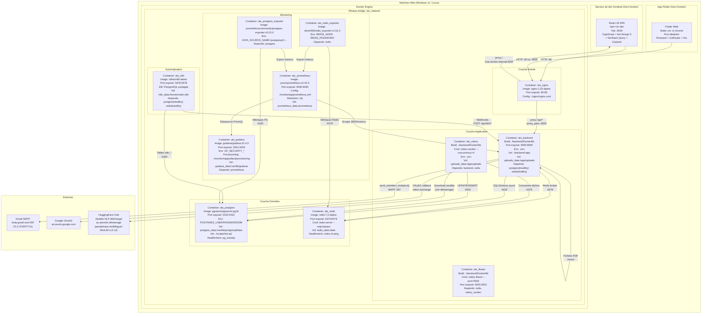

# Diagramme de Déploiement — Infrastructure ATS RANDA

## Description de l'environnement

ATS RANDA fonctionne dans un environnement de développement local où les services backend sont containerisés via Docker Compose, tandis que le frontend React tourne nativement sur la machine hôte (serveur npm). Cette architecture hybride est reflétée dans la configuration Nginx (`host.docker.internal:3000`). L'application mobile Flutter peut être lancée sur la même machine hôte (web/Chrome), sur un émulateur Android, ou sur un appareil physique.

---

## Diagramme de déploiement



---

## Configuration réseau

| Service | Image Docker | Port interne | Port exposé hôte | Variables d'env clés |
|---------|-------------|:------------:|:----------------:|----------------------|
| `postgres` | `pgvector/pgvector:pg16` | 5432 | 5432 | `POSTGRES_USER`, `POSTGRES_PASSWORD`, `POSTGRES_DB` |
| `redis` | `redis:7.2-alpine` | 6379 | 6379 | `REDIS_PASSWORD` |
| `backend` | Build local | 8000 | 8000 | Toutes variables `.env` |
| `celery_worker` | Build local | — | — | Toutes variables `.env` |
| `flower` | Build local | 5555 | 5555 | `FLOWER_USER`, `FLOWER_PASSWORD` |
| `nginx` | `nginx:1.25-alpine` | 80 | 80 | — |
| `prometheus` | `prom/prometheus:v2.52.0` | 9090 | 9090 | — |
| `grafana` | `grafana/grafana:10.4.0` | 3000 | 3001 | `GF_SECURITY_ADMIN_USER`, `GF_SECURITY_ADMIN_PASSWORD` |
| `redis-exporter` | `oliver006/redis_exporter:v1.61.0` | 9121 | — | `REDIS_ADDR`, `REDIS_PASSWORD` |
| `postgres-exporter` | `prometheuscommunity/postgres-exporter:v0.15.0` | 9187 | — | `DATA_SOURCE_NAME` |
| `n8n` | `n8nio/n8n:latest` | 5678 | 5678 | `DB_POSTGRESDB_*`, `N8N_ENCRYPTION_KEY` |

---

## Volumes et persistance

| Volume | Monté dans | Contenu | Persistant |
|--------|-----------|---------|:----------:|
| `postgres_data` | `ats_postgres:/var/lib/postgresql/data` | Toute la base de données (tables, index pgvector) | ✅ |
| `redis_data` | `ats_redis:/data` | Cache Redis (optionnel, AOF désactivé par défaut) | ✅ |
| `n8n_data` | `ats_n8n:/home/node/.n8n` | Workflows n8n, credentials, executions | ✅ |
| `uploads_data` | `ats_backend:/app/uploads` + `ats_celery:/app/uploads` | PDFs CVs, photos profil | ✅ |
| `prometheus_data` | `ats_prometheus:/prometheus` | Métriques historiques (15 jours) | ✅ |
| `grafana_data` | `ats_grafana:/var/lib/grafana` | Dashboards, datasources provisionnées | ✅ |

---

## Commandes de déploiement

```bash
# 1. Préparer l'environnement
cp .env.example .env
# Éditer .env : SECRET_KEY, POSTGRES_PASSWORD, REDIS_PASSWORD, GRAFANA_PASSWORD, FLOWER_PASSWORD

# 2. Démarrer tous les services Docker
make up
# Équivalent : docker compose up -d

# 3. Vérifier l'état des containers
make status
# Attendre que tous soient healthy (postgres + redis)

# 4. Lancer le frontend (sur la machine hôte)
cd frontend && npm install && npm run dev
# → http://localhost:3000 (proxifié par Nginx sur :80)

# 5. Lancer l'app Flutter (optionnel)
cd mobile
flutter pub get
dart run build_runner build --delete-conflicting-outputs
flutter run -d chrome  # Web (utilise http://localhost:8000)

# 6. Importer workflows n8n
# → http://localhost:5678 → Settings → Import workflow
# → Sélectionner fichiers dans n8n/workflows/

# Commandes de maintenance
make logs-backend     # Suivre les logs FastAPI
make logs             # Tous les logs
make migrate          # Migrations Alembic dans le container
make backup           # Sauvegarde PostgreSQL → backups/
make clean            # DESTRUCTIF — supprime containers + volumes
```
