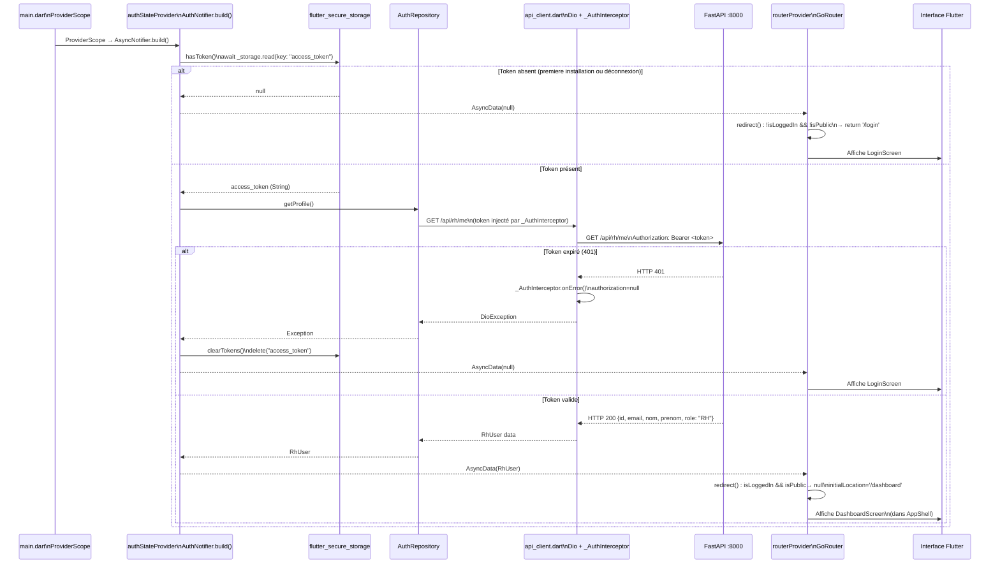
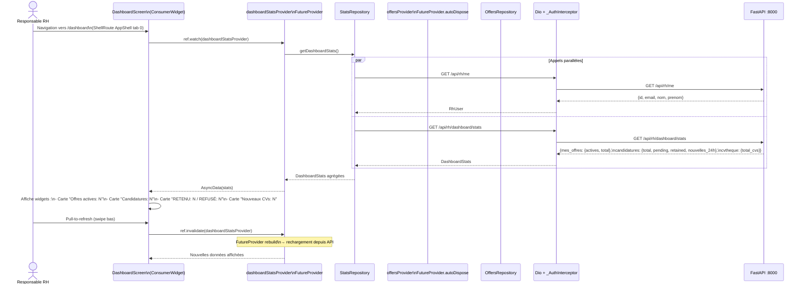
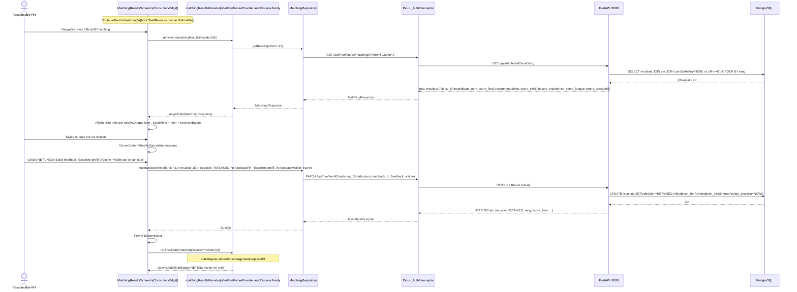
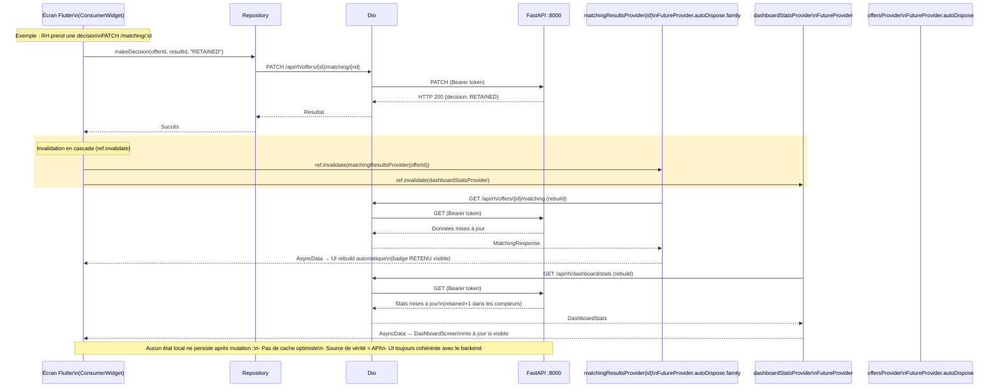

# Diagrammes de Séquence — Application Mobile Flutter RH

## Description

Ces diagrammes illustrent les flux spécifiques à l'application mobile Flutter RH, construite avec Riverpod, GoRouter et Dio. Ils sont basés sur le code réel de `mobile/lib/providers/auth_provider.dart`, `mobile/lib/router.dart`, `mobile/lib/providers/matching_provider.dart` et `mobile/lib/core/api_client.dart`. L'application cible exclusivement le rôle **RH** et se synchronise avec le backend FastAPI via Dio avec intercepteur JWT.

---

## 1. Démarrage de l'application et restauration de session

Au démarrage, `AuthNotifier.build()` tente de restaurer la session depuis `flutter_secure_storage` avant que GoRouter n'évalue la redirection.



---

## 2. Navigation et chargement du tableau de bord RH

Le tableau de bord utilise `dashboardStatsProvider` qui agrège des données depuis plusieurs providers Riverpod.



---

## 3. Consultation et prise de décision matching (mobile)



---

## 4. Synchronisation après mutation — Invalidation Riverpod en cascade

Ce diagramme montre le mécanisme de synchronisation automatique après toute mutation (décision, création d'offre, etc.).



---

## 5. Gestion de la navigation hors-shell (détail sans BottomNav)

```mermaid
sequenceDiagram
    actor RH as Responsable RH
    participant SHELL as AppShell\n(ShellRoute)\n[Dashboard|Offers|CVthèque|Calendrier]
    participant ROUTER as GoRouter
    participant OFF as OffersScreen\n(dans Shell)
    participant DET as OfferDetailScreen\n(hors Shell)
    participant MATCH as MatchingResultsScreen\n(hors Shell)

    RH->>SHELL: Tape onglet "Offers"
    SHELL->>OFF: Affiche OffersScreen\n(/offers — dans ShellRoute)

    OFF->>OFF: Liste les offres\n(ref.watch(offersProvider))

    RH->>OFF: Tape sur une offre (id=42)
    OFF->>ROUTER: context.push('/offers/42')

    Note over ROUTER: /offers/:id est HORS ShellRoute\n(pas de BottomNavigationBar)
    ROUTER->>DET: Affiche OfferDetailScreen(offerId: 42)\nAvec bouton retour ← en haut

    RH->>DET: Tape "Voir le matching"
    DET->>ROUTER: context.push('/offers/42/matching')
    ROUTER->>MATCH: Affiche MatchingResultsScreen(offerId: 42)\n(toujours hors Shell, bouton ←)

    RH->>MATCH: Appuie sur ←
    MATCH->>ROUTER: Navigator.pop()
    ROUTER->>DET: Retour OfferDetailScreen

    RH->>DET: Appuie sur ←
    DET->>ROUTER: Navigator.pop()
    ROUTER->>OFF: Retour OffersScreen\n(dans ShellRoute avec BottomNav)

    Note over SHELL: AppShell reaffiche la BottomNavigationBar\n(onglet "Offers" toujours sélectionné)
```
