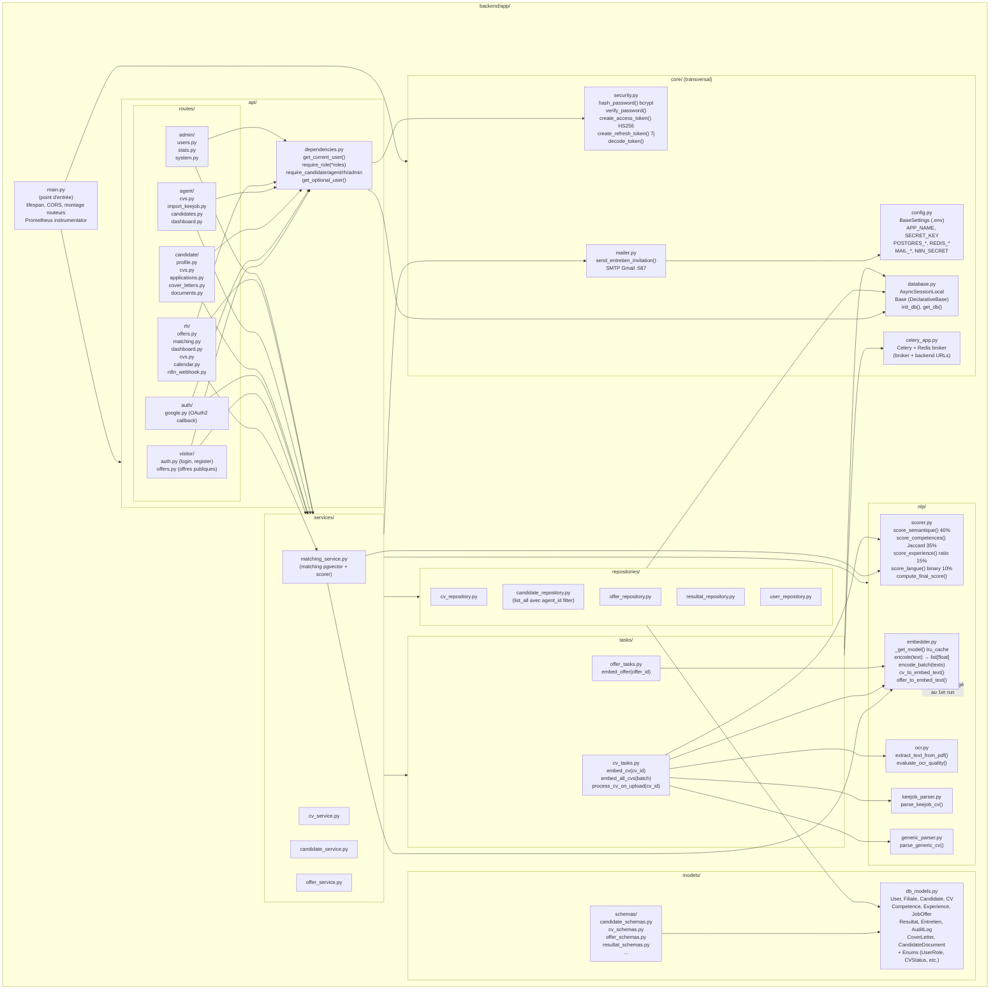
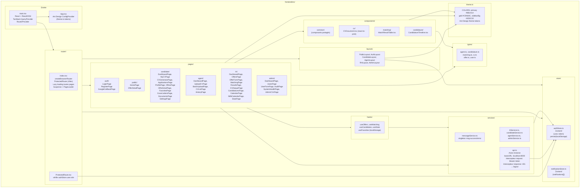
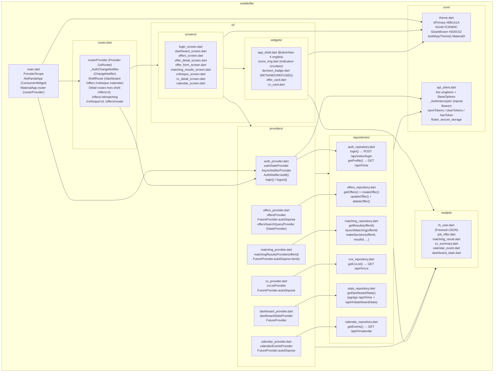

# Diagramme de Packages — Organisation du Code Source

## Description

Ce diagramme représente l'organisation des packages (modules) de chaque surface applicative d'ATS RANDA — backend FastAPI, frontend React, et application mobile Flutter — ainsi que les dépendances entre packages. Il est construit à partir de la structure réelle des imports dans `backend/app/main.py`, `frontend/src/router/index.tsx`, et `mobile/lib/router.dart`. Les flèches indiquent les dépendances de consommation (le package A utilise le package B).

---

## Backend FastAPI — Packages Python



---

## Frontend React — Packages TypeScript



---

## Mobile Flutter — Packages Dart



---

## Dépendances entre packages par surface

### Backend FastAPI — flux de données

```
HTTP Request
    ↓
api/routes/* (validation Pydantic, auth Depends)
    ↓
services/* (orchestration logique métier)
    ↓
repositories/* (requêtes SQL AsyncSession)
    ↓
models/db_models.py (SQLAlchemy ORM)
    ↓
PostgreSQL

Parallèlement :
services/* → nlp/* (embedder, scorer, ocr, parsers)
services/* → tasks/* → core/celery_app (file Redis)
services/* → core/mailer (SMTP)
Tous → core/config (variables .env)
Tous → core/database (AsyncSession)
api/dependencies → core/security (JWT)
```

### Frontend React — flux de données

```
Composant React (page)
    ↓
hooks/* (useQuery TanStack)
    ↓
services/*Service.ts (fonctions API)
    ↓
services/api.ts (Axios + intercepteurs)
    ↓
store/authStore.ts (token JWT depuis Zustand)
    ↓
HTTP → FastAPI :8000
```

### Mobile Flutter — flux de données

```
Écran Flutter (ConsumerWidget)
    ↓
ref.watch(xxxProvider) — Riverpod
    ↓
repositories/*.dart (appels HTTP)
    ↓
core/api_client.dart (Dio + _AuthInterceptor)
    ↓
flutter_secure_storage → Bearer token
    ↓
HTTP → FastAPI :8000
```
